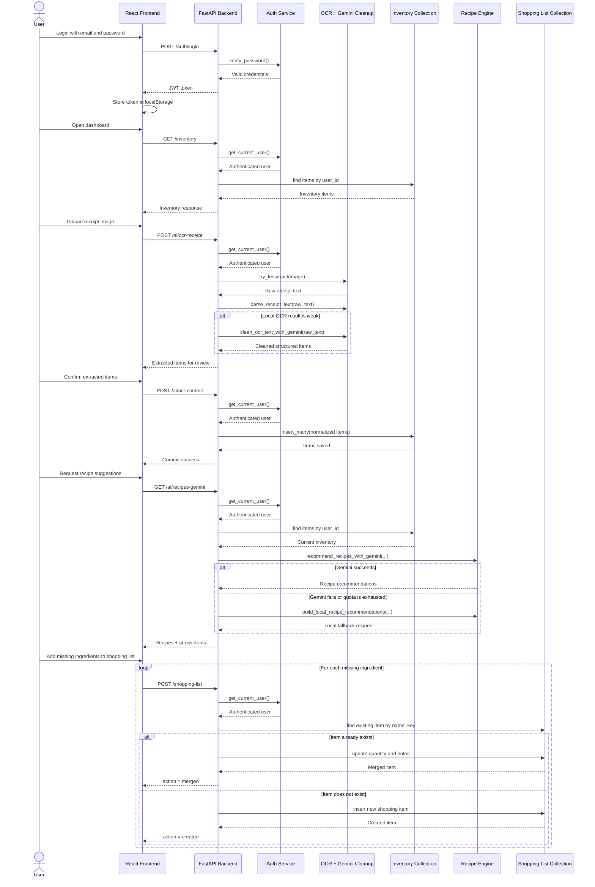
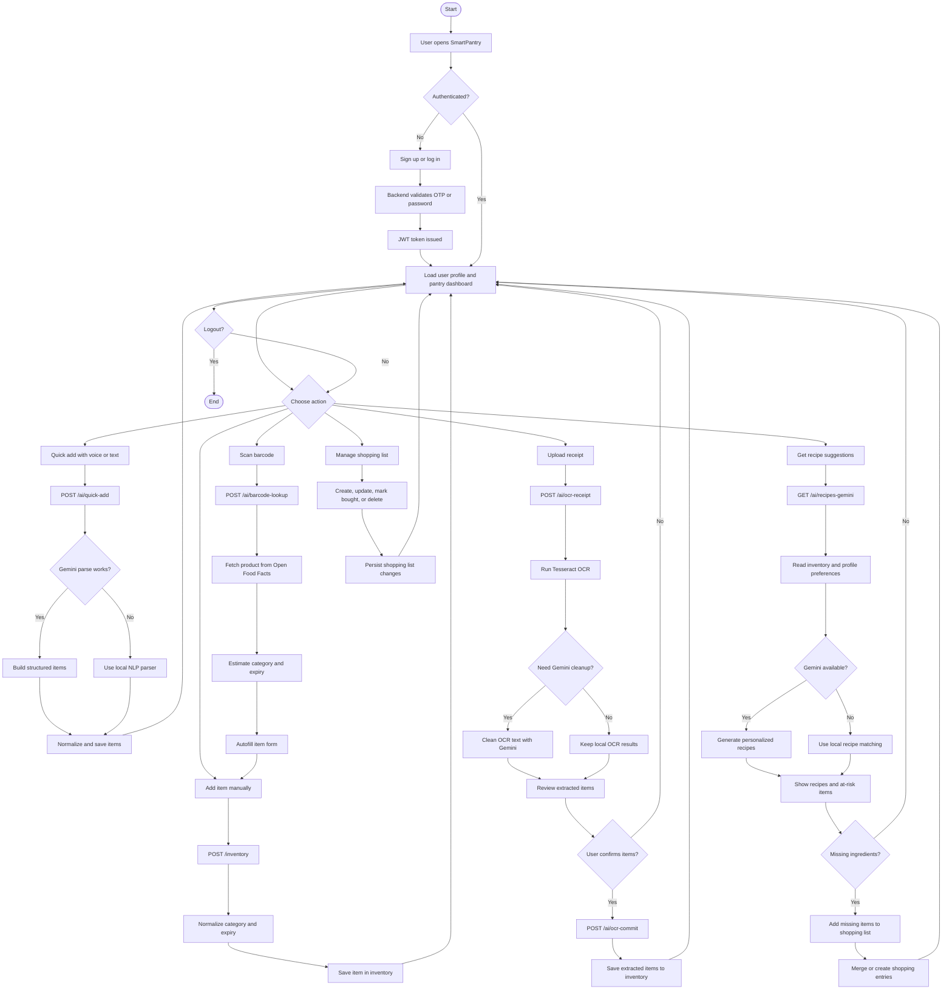

# SmartPantry Behavioral View

This document captures the main runtime behavior of SmartPantry using a sequence diagram and an activity diagram derived from the current React frontend and FastAPI backend.

## Sequence Diagram

The sequence below models a common end-to-end scenario:

- the user signs in
- loads inventory
- adds items using receipt OCR
- requests recipe recommendations
- sends missing ingredients to the shopping list

## Activity Diagram

The activity diagram below shows the main pantry-management workflow supported by the current system.

